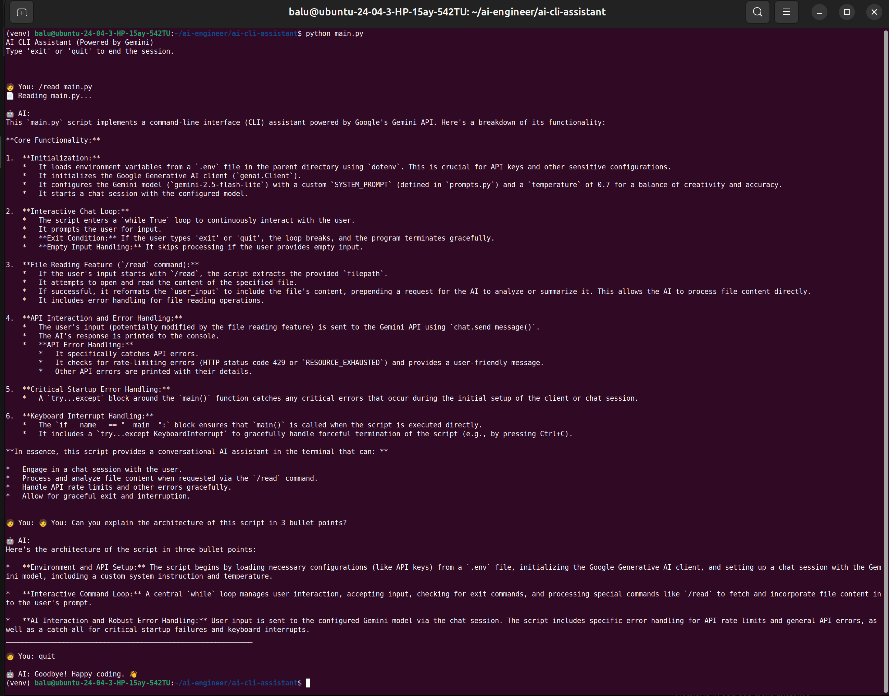

# AI CLI Assistant

A modular, terminal-based AI Assistant powered by Python and the Google Gemini API. This project goes beyond standard API calls by implementing stateful memory, system prompting, and local file analysis directly from the Linux command line.

## Architecture

This tool brings Large Language Model (LLM) capabilities directly into the native terminal environment. 

* `main.py`: Handles the conversational loop, CLI UI, and user inputs.

* `prompts.py`: A dedicated system prompting file that strictly controls the AI's persona, ensuring technical, concise, and developer-focused outputs.

## Tech Stack

* **Language:** Python 3

* **SDK:** Google GenAI SDK (`google-genai`)

* **LLM:** Google Gemini (`gemini-2.5-flash-lite`)

* **Environment:** Linux / Bash / Command Line Interface (CLI)

## Features

1. **Stateful Memory:** Maintains conversation history within the session for seamless, context-aware follow-up questions.

2. **Local File Analysis:** Features a custom `/read <filename>` command, allowing the AI to ingest and summarize local files or code scripts directly from the terminal.

3. **Resilient Error Handling:** Includes custom exception handling to gracefully manage API rate limits (like Free Tier exhaustion) or network drops without crashing the application.

## How to Run

## 1. Setup Environment

Ensure you have a `.env` file in the parent directory containing your API key:
`GEMINI_API_KEY="your_api_key_here"`

## 2. Install Dependencies

```bash
pip install -r requirements.txt
```

## 3. Launch the Assistant

Start the interactive CLI session:

```bash
python main.py
```

## Example Output

When using the custom /read command to ingest a local Python file, the assistant instantly analyzes the code and explains its architecture:


