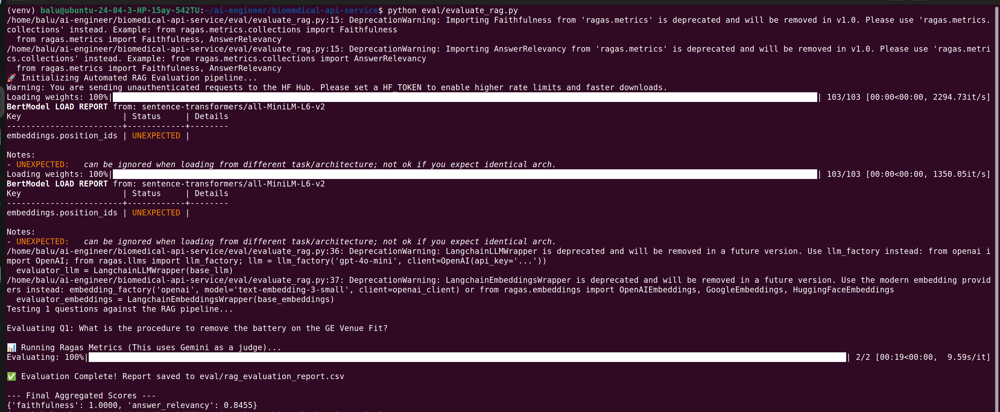

# Enterprise Biomedical AI Microservice (RAG)


An asynchronous, Dockerized AI backend designed to provide verifiable, hallucination-free troubleshooting assistance for clinical engineering teams.

## ⚠️ The Problem: Why This Project Exists

Standard LLMs present a critical safety hazard in healthcare and clinical environments because they naturally:

* **Hallucinate procedures** when unsure.

* **Suffer from "Context Bleed"**, mixing up maintenance schedules across different medical devices.

* **Provide non-verifiable answers** without physical source citations.

## ✅ The Solution

This system is a strictly guarded Retrieval-Augmented Generation (RAG) microservice that solves these issues by forcing 100% context-grounded answers, returning exact physical page citations, and maintaining stateful troubleshooting memory.


## 🚀 Engineering Solutions & Features

* **Full-Stack Observability (LangSmith):** Instrumented with complete telemetry to monitor execution waterfalls, sub-chain latency, vector retrieval speeds, and per-query token cost tracking.
  
  

* **Automated RAG Evaluation (LLM-as-a-Judge):** The pipeline is statistically audited using the open-source `ragas` framework. A dedicated evaluation script grades the RAG system against baseline golden datasets to ensure clinical safety, measuring:

  * **Faithfulness:** Verifying that 100% of the LLM's claims can be traced directly back to the physical manual chunks (preventing hallucinations).

  * **Answer Relevancy:** Ensuring the generated response directly and concisely answers the technician's prompt without tangential rambling.

* **Anti-Hallucination Guardrails:** Employs strict prompt engineering to force the LLM to answer *only* from the vector context. If a procedure is not found in the ingested manuals, the API explicitly refuses to guess.

* **"Page Drift" Correction:** Standard PDF loaders rely on digital indexing, causing citation mismatch. This service utilizes custom `PyMuPDF` extraction to identify and index the manufacturer's logical page labels, ensuring the AI cites the physical book accurately.

* **Context Bleed Prevention:** Every ingested chunk is tagged with its source filename in the ChromaDB metadata. The retriever isolates hardware-specific context.

* **Stateful Conversations:** Real-world hardware repair is conversational. Integrated `RunnableWithMessageHistory` tracks `session_id`s, allowing technicians to ask follow-up questions without losing contextual state.

## 🏗️ System Architecture

The system is decoupled into two independent workflows to ensure scalability:

1. **Ingestion Pipeline:** Asynchronously parses PDFs, applies metadata, chunks text, generates HuggingFace embeddings, and persists to ChromaDB.

2. **Query Pipeline:** Retrieves context, applies guardrails, formats markdown, and streams outputs via Server-Sent Events (SSE).


## 🛠️ Tech Stack

* **Framework:** FastAPI, Python 3.12

* **AI/Orchestration:** LangChain, Google Gemini (gemini-2.5-flash)

* **Observability:** LangSmith

* **Evaluation:** Ragas, HuggingFace Datasets

* **Vector Database:** ChromaDB (Native disk persistence)

* **Embeddings:** HuggingFace (`all-MiniLM-L6-v2`)

* **Document Parsing:** PyMuPDF (`fitz`)

* **Deployment:** Docker

## 📦 Quick Start (Docker)

To spin up this microservice locally for immediate testing, you need Docker installed and a Gemini API key.

**1. Clone the repository:**

```bash
git clone https://github.com/balakrishna-arigala26/biomedical-api-service.git
cd biomedical-api-service
```

**2. Set Your environment variables:**

Create a .env file in the root directory:

```text
# LLM Provider
GOOGLE_API_KEY="your_gemini_api_key"

# LangSmith Observability
LANGCHAIN_TRACING_V2=true
LANGCHAIN_ENDPOINT="[https://api.smith.langchain.com](https://api.smith.langchain.com)"
LANGCHAIN_API_KEY="your_langsmith_api_key"
LANGCHAIN_PROJECT="enterprise-biomedical-ai-v1"
```

**3. Build and Run the Container:**

```bash
docker build -t biomedical-ai-service .
docker run -d -p 8000:8000 --env-file .env biomedical-ai-service
```

**4. Access the Interactive API Docs:**

Navigate to http://localhost:8000/docs to test the endpoints via Swagger UI.

## 💻 Local Development (Without Docker)

To run the application locally for development, you will need two separate terminal windows for the backend and frontend.

**1. Clone the repository:**

```bash
git clone https://github.com/balakrishna-arigala26/biomedical-api-service.git
cd biomedical-api-service
```

**2. Create and activate a virtual environment:**

```bash
python -m venv venv
source venv/bin/activate  # On Windows use: venv\Scripts\activate
```

**3. Install Dependencies:**

```bash
pip install -r requirements.txt
```

**4. Set your environment variables:**

Ensure your `.env` file is created exactly as shown in the Docker setup above.

**5. Start the FastAPI Backend (Terminal 1):**

Open a terminal window, ensure you are in the project root with the virtual environment activated, and run:

```bash
uvicorn app.main:app --reload
```

**6. Start the Streamlit UI (Terminal 2):**

Open a second terminal window, ensure you are in the project root with the virtual environment activated, and run:

```bash
streamlit run frontend/ui.py
```

The frontend UI will automatically open in your browser at `http://localhost:8501`

## 📡 API Reference

### `POST /upload-manuals`

Ingests one or multiple PDF manuals, chunks the text, embeds it via HuggingFace, and automatically persists it to the local ChromaDB database.

* **Body:** `multipart/form-data`(Accepts an array of files)
* **Response:** `{"message": "Successfully processed X manuals"}`

### `POST /ask`

Queries the RAG pipeline with a technician's question and a session ID for conversational memory.

* **Body (JSON):**

```text
{
    "question": "What is the procedure to remove the battery on the GE Venue Fit?",
    "session_id": "tech-session-01"
}
```

### `POST /ask-stream`

Queries the RAG pipeline and returns a Server-Sent Events (SSE) stream. Designed for low Time-to-First-Token (TTFT) interactions in frontend UI applications.

### `GET /health`

Standard production health check for load balancers and cloud deployment environments.

### 📊 Running the Automated Evaluation (Ragas)

This project uses the `ragas` framework to statistically audit the LLM's performance, ensuring strict clinical safety before deployment. It operates as an offline **LLM-as-a-Judge** architecture:

1. **Input:** The script injects a dataset of "Golden Questions" into the RAG pipeline.

2. **Retrieve & Generate:** The live system queries **ChromaDB** and generates an answer.

3. **Audit:** A secondary, strictly templated LLM grades the output for **Faithfulness** (hallucination prevention) and **Answer Relevancy**.



**To run the audit locally:**

1. Ensure your virtual environment is activated.

2. Install the specific evaluation dependencies (if not already installed via `requirements.txt`):

```bash
pip install ragas datasets pandas
```

3. Run the evaluation script from the project root:

```bash
python eval/evaluate_rag.py
```

4. The pipeline will output the aggregated metrics to your terminal and save a detailed CSV report to `eval/rag_evaluation_report.csv`.

(`Note:` The evaluation script contains deliberate API throttling to respect free-tier rate limits. A full run of the test suite may take a few minutes).

## 🗺️ Roadmap & Future Enhancements

* **Cloud Native Deployment:** Deploying the FastAPI backend to **Google Cloud Run** using a streamlined, CPU-optimized Docker image.

* **Vector Architecture Pivot:** Migrating from local HuggingFace embeddings to API-based embeddings (e.g., `text-embedding-004`) to reduce the Docker container footprint from ~6GB to < 2GB.

* **Expanded Evaluation:** Scaling the `ragas` Golden Dataset to cover edge-case cross-contamination scenarios between distinct medical devices.
