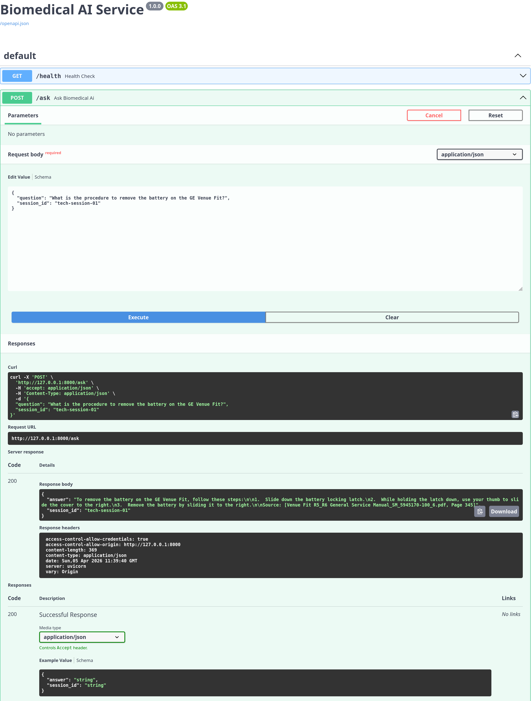
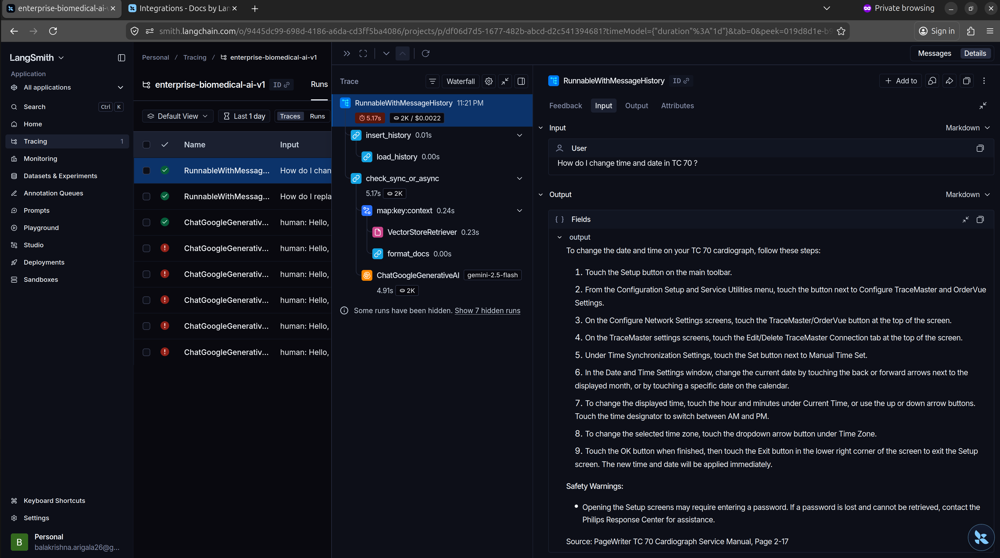
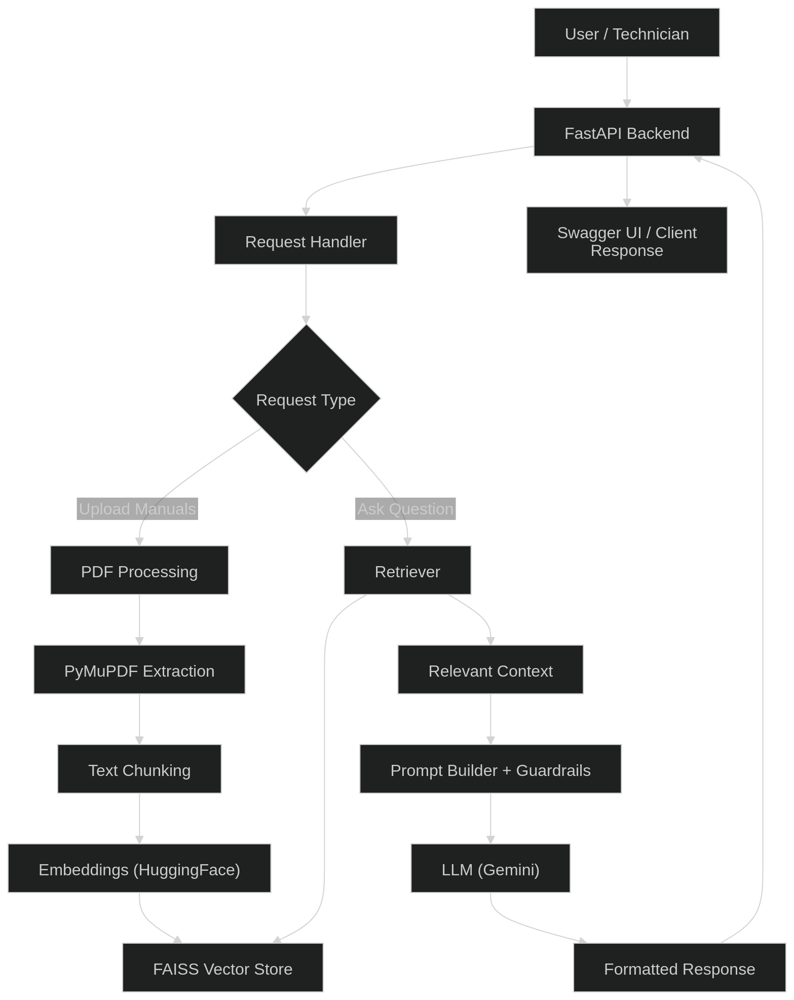

# Enterprise Biomedical AI Microservice (RAG)


An asynchronous, Dockerized AI backend designed to provide verifiable, hallucination-free troubleshooting assistance for clinical engineering teams.

Standard LLMs are prone to hallucination and "context bleed" when queried across multiple technical manuals, which presents a critical safety hazard in HealthTech environments. This microservice solves these issues by implementing a strictly guarded Retrieval-Augmented Generation (RAG) pipeline with exact physical page citations.



## 🚀 Key Features & Engineering Solutions

* **Full-Stack Observability (LangSmith):** Instrumented with complete telemetry to monitor execution waterfalls, sub-chain latency, vector retrieval speeds, and per-query token cost tracking, ensuring enterprise-level reliability and rapid debugging.
  


* **Anti-Hallucination Guardrails:** Employs strict prompt engineering to force the LLM to answer *only* from the vector context. If a procedure is not found in the ingested manuals, the API explicitly refuses to guess.

* **"Page Drift" Correction:** Standard PDF loaders rely on digital indexing, causing citation mismatch. This service utilizes custom `PyMuPDF` extraction to identify and index the manufacturer's logical page labels, ensuring the AI cites the physical book accurately.

* **Context Bleed Prevention:** Every ingested chunk is tagged with its source filename in the FAISS metadata. The retriever isolates hardware-specific context, preventing the AI from mixing up maintenance schedules across different medical devices.

* **Stateful Troubleshooting:** Real-world hardware repair is conversational. Integrated `RunnableWithMessageHistory` tracks `session_id`s, allowing technicians to ask follow-up questions without losing contextual state.

* **UI-Perfect Formatting:** The API enforces strict Markdown structuring (separating procedural steps from bolded safety warnings) so the downstream frontend UI always renders a clean, readable layout.

## 🛠️ Tech Stack

* **Framework:** FastAPI, Python 3.12

* **AI/Orchestration:** LangChain, Google Gemini (gemini-2.5-flash)

* **Observability:** LangSmith

* **Vector Database:** FAISS (Local persistence for HIPAA/security compliance)

* **Embeddings:** HuggingFace (`all-MiniLM-L6-v2`)

* **Document Parsing:** PyMuPDF (`fitz`)

* **Deployment:** Docker

## 🏗️ System Architecture



This architecture outlines both the asynchronous document ingestion pipeline (utilizing PyMuPDF for physical page metadata tagging) and the conversational retrieval pipeline (enforcing strict guardrails before LLM generation).

## 📦 Quick Start (Docker)

To spin up this microservice locally for immediate testing, you need Docker installed and a Gemini API key.

**1. Clone the repository:**

```bash
git clone [https://github.com/balakrishna-arigala26/biomedical-api-service.git](https://github.com/balakrishna-arigala26/biomedical-api-service.git)
cd biomedical-api-service
```

**2. Set Your environment variables:**

Create a .env file in the root directory:

```text
# LLM Provider
GOOGLE_API_KEY="your_gemini_api_key"

# LangSmith Observability
LANGCHAIN_TRACING_V2=true
LANGCHAIN_ENDPOINT="[https://api.smith.langchain.com](https://api.smith.langchain.com)"
LANGCHAIN_API_KEY="your_langsmith_api_key"
LANGCHAIN_PROJECT="enterprise-biomedical-ai-v1"
```

**3. Build and Run the Container:**

```bash
docker build -t biomedical-ai-service .
docker run -d -p 8000:8000 --env-file .env biomedical-ai-service
```

**4. Access the Interactive API Docs:**

Navigate to http://localhost:8000/docs to test the endpoints via Swagger UI.

## 💻 Local Development (Without Docker)

If you prefer to run the application locally for development or debugging, follow these steps:

**1. Clone the repository:**

```bash
git clone [https://github.com/balakrishna-arigala26/biomedical-api-service.git](https://github.com/balakrishna-arigala26/biomedical-api-service.git)
cd biomedical-api-service
```

**2. Create and activate a virtual environment:**

```bash
python -m venv venv
source venv/bin/activate  # On Windows use: venv\Scripts\activate
```

**3. Install Dependencies:**

```bash
pip install -r requirements.txt
```

**4. Set your environment variables:**

Ensure your `.env` file is created exactly as shown in the Docker setup above.

**5. Start the FastAPI server:**

```bash
uvicorn app.main:app --reload
```

## 📡 API Reference

### `POST /upload-manuals`

Ingests one or multiple PDF manuals, chunks the text, embeds it via HuggingFace, and merges it into the persistent FAISS vector store.

* **Body:** `multipart/form-data`(Accepts an array of files)
* **Response:** `{"message": "Successfully  processed X manuals"}`

### `POST /ask`

Queries the RAG pipeline with a technician's question and a session ID for conversational memory.

* **Body (JSON):**

```text
JSON
{
    "question": "What is the procedure to remove the battery on the GE Venue Fit?",
    "session_id": "tech-session-01"
}
```

### `GET /health`

Standard production health check for load balancers and cloud deployment environments.
