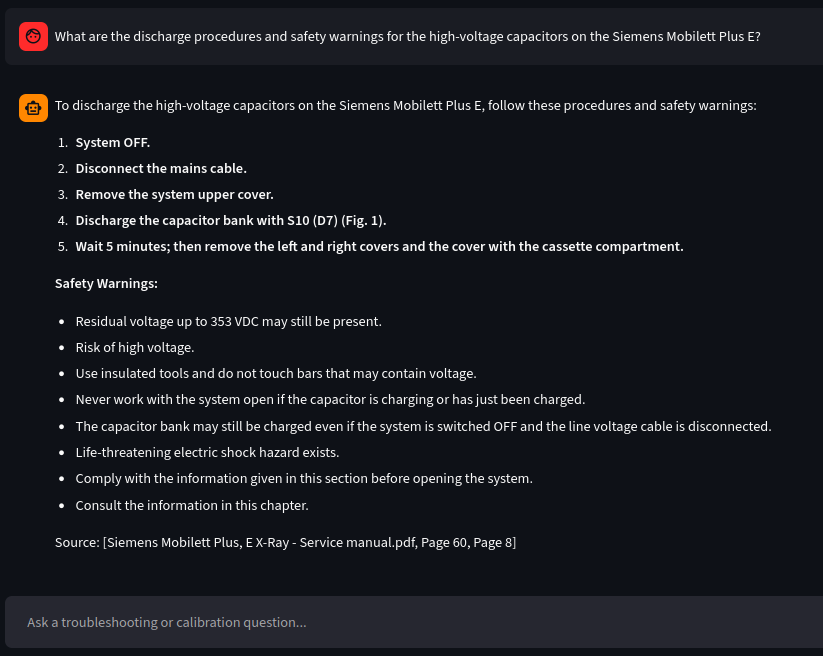
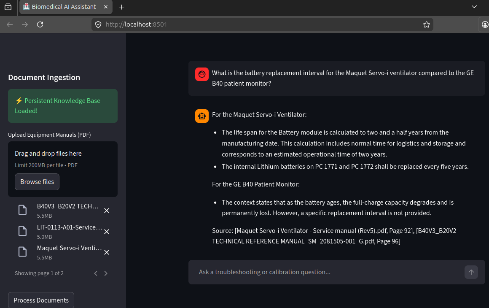
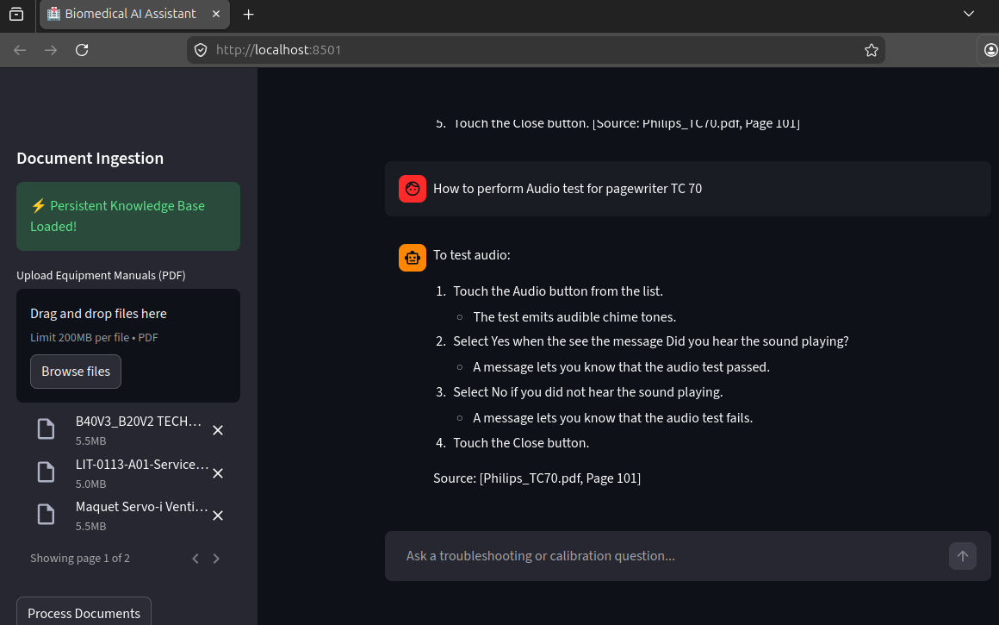

# 🏥 Agentic RAG: Biomedical Equipment AI Assistant

**Bridging 6 years of Biomedical Engineering expertise with modern AI Development.**

This application is an enterprise-grade AI Assistant designed specifically for HealthTech technicians. It allows users to upload massive, complex OEM service manuals (e.g., Philips, GE, Siemens, Maquet, FLIGHT MEDICAL) and instantly retrieve highly accurate troubleshooting steps, error code decryptions, safety warnings, and calibration procedures.

It is built using a modern **Agentic RAG (Retrieval-Augmented Generation)** architecture, prioritizing data privacy, speed, and strict hallucination guardrails.

---

## 🚀 Key Features & Architectural Decisions

* **v1.1 Logical Page Metadata Extraction:** Bypassed standard LangChain PDF loaders (which rely on absolute indexes) and wrote a custom PyMuPDF (`fitz`) extraction loop. The AI now actively hunts down the manufacturer's embedded *Logical Page Labels*, ensuring citations perfectly match the printed physical manuals and eliminating "page drift."

* **Strict Hallucination Guardrails:** HealthTech requires absolute precision. The AI is explicitly prompted via LangChain Expression Language (LCEL) to state *"I cannot find this in the uploaded manuals"* if the answer is missing, completely preventing dangerous guesswork on life-support equipment.

* **Zero-Latency RAG (Persistent Storage):** Engineered local vector database caching using FAISS. After the initial document ingestion, the application saves the vectorized data to the local disk, dropping future application boot and load times from minutes to milliseconds.

* **Local, Privacy-First Embeddings:** Swapped out cloud-based embedding APIs for a local Hugging Face Model (`all-MiniLM-L6-v2`) to ensure proprietary hospital data never leaves the local machine during the vectorization phase.

* **Modern AI Orchestration:** Bypasses legacy LangChain `.chains` in favor of the production-standard LCEL (`RunnablePassthrough`, `StrOutputParser`) for faster execution and granular prompt control.

---

## 🧪 Technical Validation & RAG Performance

### 1. High-Stakes Safety & Guardrails (v1.1)

*Extracting strict capacitor discharge procedures and life-safety warnings from a Siemens X-Ray manual. The LLM is explicitly grounded to prioritize electrical warnings, format them cleanly for the UI, and cite exact pages.*



### 2. Multi-Document Fleet Routing

*The FAISS vector database accurately routing a query through multiple simultaneously loaded OEM manuals (GE, Philips, Maquet, Siemens) without context-contamination.*



### 3. UI Preservation & Logical Metadata

*Demonstrating the custom PyMuPDF extraction logic. The pipeline ensures complex, nested procedures (like touch screen calibrations) maintain their visual hierarchy and end with a single, highly accurate citation.*



---

## 🛠️ Tech Stack

* **Frontend UI:** Streamlit

* **LLM Engine:** Google Gemini 2.5 Flash Lite (`ChatGoogleGenerativeAI`)

* **Document Processing:** PyMuPDF (`fitz`)

* **Vector Database:** FAISS (Facebook AI Similarity Search)

* **Embeddings:** Hugging Face sentence-transformers (`all-MiniLM-L6-v2`)

---

## 🧠 Engineering Challenges & Troubleshooting Log

Building this application required solving several real-world environment and API routing issues:

1. **The Protobuf Dependency Conflict:** Streamlit required an older version of the `protobuf` library than Google's Gemini SDK.

    * *Solution:* Isolated the environment and forcefully downgraded protobuf (`pip install protobuf==5.29.3`) to find the exact version that stabilized both libraries without breaking the LangChain wrapper.

2. **LangChain Legacy Deprecation:** The initial build attempted to use `langchain.chains.RetrievalQA`, which caused `ModuleNotFoundError` issues as LangChain rapidly deprecates older modules.

    * *Solution:* Completely refactored the AI logic to use **LCEL (LangChain Expression Language)**, making the pipeline faster, more modern, and immune to legacy import errors.

3. **Google API Embedding Routing Errors (`404 NOT_FOUND`):** The `v1beta` Gemini API struggled to correctly route requests to legacy embedding models via the LangChain wrapper, causing silent crashes during ingestion.

    * *Solution:* Architected a hybrid approach. Kept Gemini for the final text generation but swapped the embedding engine to a local, open-source Hugging Face model (`sentence-transformers/all-MiniLM-L6-v2`). This bypassed the API bottleneck entirely, improved processing speed, and added a layer of data privacy.

4. **API Rate Limiting & Quota Exhaustion:** Initial testing of multi-document ingestion rapidly hit the `429 RESOURCE_EXHAUSTED` limits of the free-tier LLM.

    * *Solution:* Implemented environment variable isolation using `python-dotenv` to safely manage API keys and successfully orchestrated a persistent local vector database so documents only need to be processed via the CPU once, saving massive amounts of compute time and API overhead.

---

## ⚙️ How to Run Locally

**1. Clone the repository and navigate to the project directory:**

```bash
git clone https://github.com/balakrishna-arigala26/ai-engineer-portfolio.git
cd ai-engineer-portfolio/biomedical-equipment-ai-assistant
```

**2. Create and activate virtual environment:**

```bash
python3 -m venv venv
source venv/bin/activate # On Windows: venv\Scripts\activate
```

**3. Install Dependencies:**

```bash
pip install -r requirements.txt
```

**4. Set up your API Keys:**

Create a .env file in the project directory and add your Google Gemini API key:

GOOGLE_API_KEY="your_api_key_here"

**5. Run the application:**

```bash
streamlit run app.py
```

## 🔮 Future Upgrades Roadmap

(Currently building in public on Linkedin)

* **v1.0 (MVP):** Core RAG Architecture & Zero-Latency Persistence [✅ Completed]

* **v1.1 (Verifiability Update):** Logical Metadata Extraction & Strict Citation Guardrails [✅ Completed]

* **v1.2 (Conversational Memory):** Add a rolling buffer to allow technicians to ask follow-up questions without losing context. [⏳ Planned]

* **v1.3 (Advanced Retrieval):** Implement a Cross-Encoder Re-Ranker (MMR) to improve needle-in-a-haystack data extraction. [⏳ Planned]
